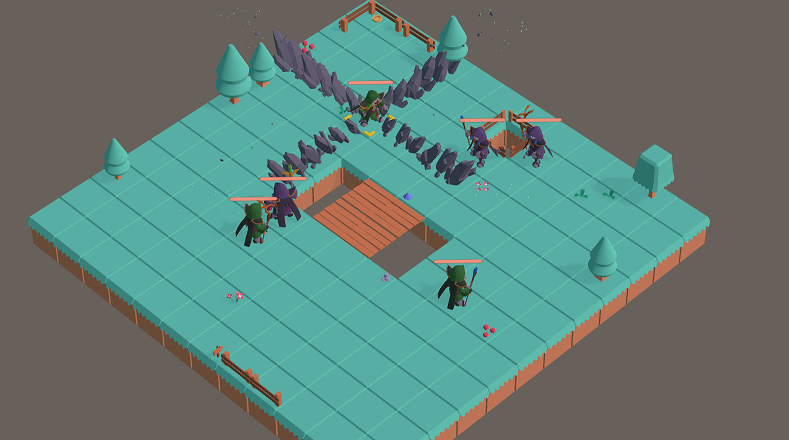
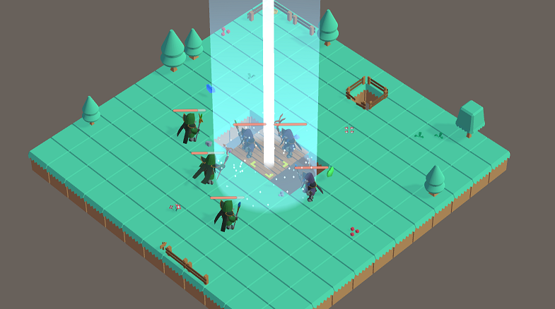
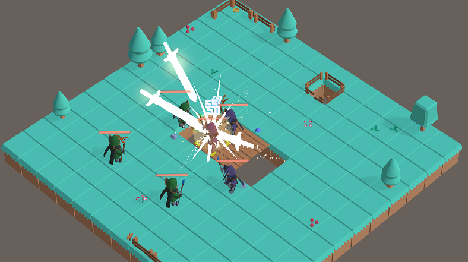
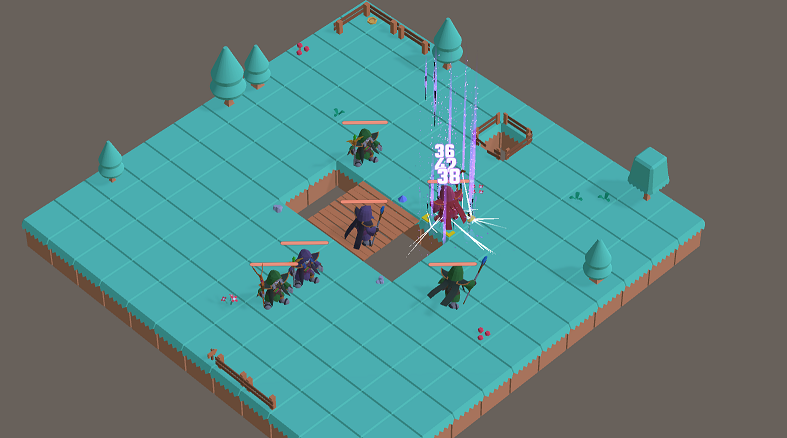

# TacticsGame
Tactics RPG is a 3D turn-based strategy game featuring different magical skills and strategic combat.

Inspired by games like "Final Fantasy Tactics Advance," this demo showcases some mechanics that define the tactics genre.
Having always been a fan of tactical RPGs, I wanted to at least implement the fundamental aspects of tactical combat.

Try it: [weizh2.itch.io/tactics-rpg](weizh2.itch.io/tactics-rpg).

